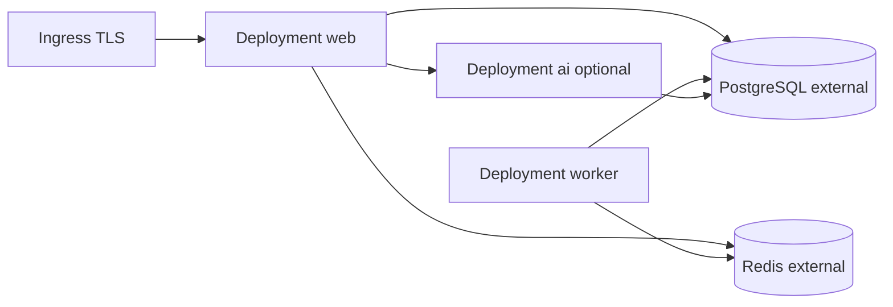

# Kubernetes install

**Russian:** [docs/ru/install/KUBERNETES.md](../ru/install/KUBERNETES.md)

Deploy to Kubernetes using the Helm chart [`deploy/helm/demo/`](../../deploy/helm/demo/).  
Application configuration: [`../CONFIGURATION.md`](../CONFIGURATION.md) · checklist: [`../PRODUCTION_DEPLOY.md`](../PRODUCTION_DEPLOY.md).

---

## Prerequisites

| Tool | Version |
|------|---------|
| Kubernetes | 1.28+ |
| Helm | 3.x |
| kubectl | matching cluster |
| Container registry | images for Laravel app (+ optional AI worker) |

External dependencies (recommended):

- **PostgreSQL** 15+ (managed RDS / Cloud SQL / in-cluster operator)
- **Redis** 7+ (managed or in-cluster)
- **Ingress controller** (nginx-ingress, Traefik, …)
- **cert-manager** (TLS)

---

## Build and push images

```bash
# Laravel / PHP production image
docker build -f backend/php/Dockerfile.prod -t your-registry/cms-blog:1.0.0 .
docker push your-registry/cms-blog:1.0.0

# Nginx (prod Dockerfile bundles static assets or mounts volume)
docker build -f backend/nginx/Dockerfile.prod -t your-registry/cms-blog-nginx:1.0.0 .
docker push your-registry/cms-blog-nginx:1.0.0

# Optional AI worker
docker build -f ai-service/Dockerfile -t your-registry/cms-blog-ai:1.0.0 ./ai-service
docker push your-registry/cms-blog-ai:1.0.0
```

Frontend assets must be built (`npm ci && npm run build`) **before** image build or via CI stage.

---

## Helm install (skeleton)

```bash
helm upgrade --install demo ./deploy/helm/demo \
  --namespace demo --create-namespace \
  --set image.repository=your-registry/cms-blog \
  --set image.tag=1.0.0 \
  --set worker.enabled=true \
  --set aiService.enabled=false \
  --set ingress.enabled=true \
  --set ingress.hosts[0].host=demo.example.com
```

Verify:

```bash
kubectl -n demo get pods
kubectl -n demo port-forward svc/demo-web 8080:80
curl -fsS http://127.0.0.1:8080/health
```

---

## Values reference

| Key | Default | Description |
|-----|---------|-------------|
| `replicaCount` | `1` | Web Deployment replicas |
| `image.repository` | — | Laravel/PHP image |
| `image.tag` | `latest` | Image tag |
| `worker.enabled` | `true` | Queue worker Deployment |
| `aiService.enabled` | `false` | Python AI Deployment |
| `ingress.enabled` | `false` | Create Ingress |
| `ingress.hosts` | `[]` | Hostnames + paths |
| `probes.livenessPath` | `/up` | Liveness probe |
| `probes.readinessPath` | `/health` | Readiness probe |
| `database.external` | `true` | Use external PostgreSQL |
| `redis.external` | `true` | Use external Redis |

Inspect defaults:

```bash
helm show values ./deploy/helm/demo
```

---

## Secrets and ConfigMap (production)

Chart is a **skeleton** — create Secrets before go-live:

```bash
kubectl -n demo create secret generic demo-app \
  --from-literal=APP_KEY='base64:...' \
  --from-literal=DB_PASSWORD='...' \
  --from-literal=REDIS_PASSWORD='...' \
  --from-literal=PAYMENT_HTTP_SECRET='...' \
  --from-literal=PAYMENT_WEBHOOK_SECRET='...'
```

Map env vars from [`../CONFIGURATION.md`](../CONFIGURATION.md). Minimum:

| Variable | Source |
|----------|--------|
| `APP_KEY` | Secret |
| `APP_ENV` | `production` |
| `APP_DEBUG` | `false` |
| `APP_URL` | `https://demo.example.com` |
| `DB_HOST`, `DB_*` | Secret / external service DNS |
| `REDIS_HOST`, `REDIS_PASSWORD` | Secret |
| `QUEUE_CONNECTION` | `redis` |
| `CACHE_STORE`, `SESSION_DRIVER` | `redis` |
| `SEED_OWNER_*` | Secret (init Job only) |

Wire Secrets in chart templates or use `envFrom` in custom values overlay.

---

## Init Job (migrate + bootstrap)

Recommended one-time Job before/web rollout:

```yaml
# Example — adapt to your values overlay
apiVersion: batch/v1
kind: Job
metadata:
  name: demo-install
  namespace: demo
spec:
  template:
    spec:
      restartPolicy: Never
      containers:
        - name: install
          image: your-registry/cms-blog:1.0.0
          command:
            - /bin/sh
            - -c
            - |
              php artisan migrate --force
              php artisan app:bootstrap --force
          envFrom:
            - secretRef:
                name: demo-app
```

Alternatively use Docker prod profile locally:  
`docker compose -f docker-compose.prod.yml --profile install up install`.

---

## Topology



---

## Storage

Persist Laravel `storage/` (uploads, logs):

- PVC bound to web and worker pods, **or**
- S3-compatible filesystem (`FILESYSTEM_DISK=s3` — configure in `.env` / Secret)

`bootstrap/cache` can use emptyDir with init cache warm-up or shared PVC.

---

## Scaling and availability

| Component | Recommendation |
|-----------|----------------|
| Web | HPA on CPU/memory; `replicaCount` ≥ 2 |
| Worker | Separate Deployment; scale on queue depth (KEDA optional) |
| DB / Redis | Managed HA services |
| Sessions | Redis (required for multi-replica web) |

Probes (already in chart values):

- **Liveness:** `GET /up`
- **Readiness:** `GET /health`

Align with [`../OPERATIONS.md`](../OPERATIONS.md).

---

## Ingress and TLS

Example values snippet:

```yaml
ingress:
  enabled: true
  className: nginx
  annotations:
    cert-manager.io/cluster-issuer: letsencrypt-prod
  hosts:
    - host: demo.example.com
      paths:
        - path: /
          pathType: Prefix
  tls:
    - secretName: demo-tls
      hosts:
        - demo.example.com
```

Set `APP_URL=https://demo.example.com`, `SESSION_SECURE_COOKIE=true`, `SECURITY_HSTS_ENABLED=true`.

---

## Optional AI service

```bash
helm upgrade --install demo ./deploy/helm/demo \
  --reuse-values \
  --set aiService.enabled=true \
  --set aiService.image.repository=your-registry/cms-blog-ai
```

Env for AI pod: `DATABASE_URL`, `OPENAI_API_KEY` (Secret).  
Laravel: `AI_SERVICE_URL=http://demo-ai:8000` (cluster DNS).

---

## Observability (planned)

See open items in [`../ROADMAP.md`](../ROADMAP.md): Prometheus metrics, centralized logging, GitOps.

---

## Upgrade / rollback

```bash
helm upgrade demo ./deploy/helm/demo -n demo -f my-values.yaml
helm rollback demo 1 -n demo
kubectl -n demo rollout status deployment/demo-web
```

Run migrations on upgrade via Helm hook Job or CI pipeline step.

---

## Troubleshooting

| Problem | Check |
|---------|-------|
| CrashLoopBackOff | `kubectl logs`, `APP_KEY`, DB connectivity |
| 502 from Ingress | Readiness probe `/health`, service port 80 |
| Sessions lost across pods | `SESSION_DRIVER=redis`, Redis reachable |
| Static assets 404 | Assets baked in nginx image or CDN |
| Queue not processing | Worker Deployment running, `REDIS_HOST` correct |

---

## Related

- Docker prod (simpler single-node): [DOCKER.md](DOCKER.md)
- Native Linux server: [LINUX.md](LINUX.md)
- All env vars: [CONFIGURATION.md](../CONFIGURATION.md)
